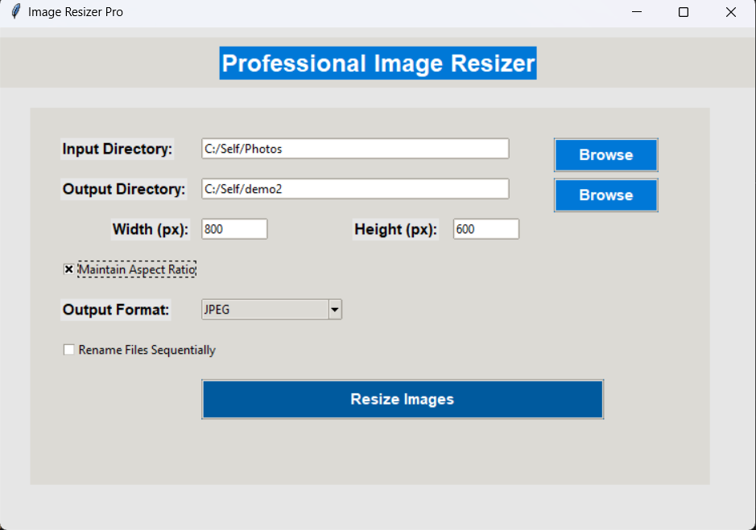

# Image Resizer Pro

**Image Resizer Pro** is a simple and intuitive tool for resizing multiple images at once. This application allows you to easily select a folder of images, customize the size, choose the output format, and optionally rename the images sequentially. It also offers the option to maintain the aspect ratio of the images while resizing.

## Features:
- **Input/Output Folders:** Select an input directory containing images and an output directory for the resized images.
- **Resize Options:** Set custom width and height for the images.
- **Maintain Aspect Ratio:** Optionally keep the original aspect ratio while resizing.
- **Output Format:** Choose from multiple formats like JPEG, PNG, BMP, and GIF.
- **Batch Rename:** Rename images sequentially (e.g., image_1.jpg, image_2.jpg) during the resizing process.

## How to Use:
1. **Select Input Directory:**
   - Click "Browse" under Input Directory to choose the folder containing the images you want to resize.
   
2. **Select Output Directory:**
   - Click "Browse" under Output Directory to choose where the resized images will be saved.
   
3. **Set Width and Height:**
   - Enter your desired dimensions for width and height.

4. **Maintain Aspect Ratio (Optional):**
   - Check the box if you want to preserve the image’s aspect ratio while resizing.

5. **Choose Output Format:**
   - Use the dropdown to select the output image format (JPEG, PNG, BMP, GIF).

6. **Batch Rename (Optional):**
   - Enable the checkbox to rename files sequentially (e.g., image_1.jpg, image_2.jpg).
   
7. **Resize Images:**
   - Click "Resize Images" to begin the process. A confirmation will appear once all images are resized and saved.

## Screenshot:


## Installation:

1. Clone this repository:
   ```bash
   git clone https://github.com/GojiyaDev/Image_Resizer.git
